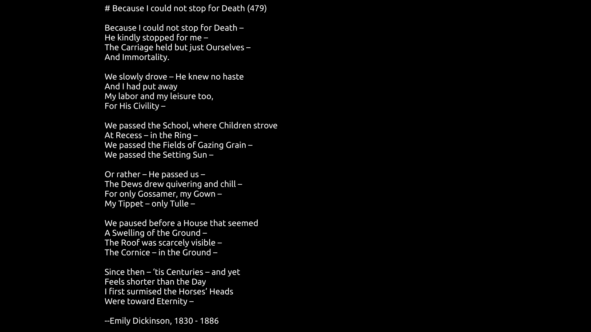

# Poetry Wall

I found a site that had a few works of poetry formatted for phone wallpapers with little drawings. They were lovely. They were also black-on-white and blinding at night.

## Install

Make sure that `$HOME/.cargo/bin` is in your path, and then you can do this;

```bash
cargo +nightly install --git https://github.com/erochest/poetry-wall.git
```

## Usage

You'll need to have a TTF file for the font. An OTF file will also work, as long as its data conforms to TrueType fonts. There's a font ([DejaVu Sans Mono](https://dejavu-fonts.github.io/)) in the `./tests/fixtures` folder of the repo to help you get started.

The poem or text that you want to create an image from should be in a text file. In spite of what the help message implies, it currently doesn't do any special formatting for markdown, but maybe someday.

The options are all set for me. And it tries to set the left margin automatically, but this may not work for your combination of poem and screen size, so you may need to play with this setting to get it right.

```
poetry-wall --font ~/Library/Fonts/Ubuntu-R.ttf --poem ~/tmp/death.md --output ~/Dropbox/tmp/death.png
``` 

And the output: 



## Options

```
poetry-wall 0.1.0
Eric Rochester <erochest@gmail.com>


USAGE:
    poetry-wall [OPTIONS] --font <TTF_FONT> --output <PNG_FILE> --poem <MARKDOWN_FILE>

FLAGS:
    -h, --help       Prints help information
    -V, --version    Prints version information

OPTIONS:
    -b, --background <CSS_COLOR_NAME>    The CSS name of the background color to use. [default: black]
    -c, --color <CSS_COLOR_NAME>         The CSS name of the text color to use. [default: white]
    -d, --dimensions <DIMENSION>         The size of image to create, in the form 'WIDTHxHEIGHT'. [default: 1920x1080]
    -f, --font <TTF_FONT>                The TTF font to use rendering the poem.
    -l, --left <NUMBER>                  The size of the left margin. If omitted, it's computed.
    -F, --max-font-size <TTF_FONT>       The size of type to use rendering the poem. If there's not enough room, it will
                                         be scaled down. [default: 72]
    -o, --output <PNG_FILE>              The output file to be created as a PNG.
    -p, --poem <MARKDOWN_FILE>           The poem to render in a markdown file.
    -t, --top <NUMBER>                   The size of the top margin. If omitted, it's computed.

```

## Contributions

Pull requests or other feedback are welcomed!